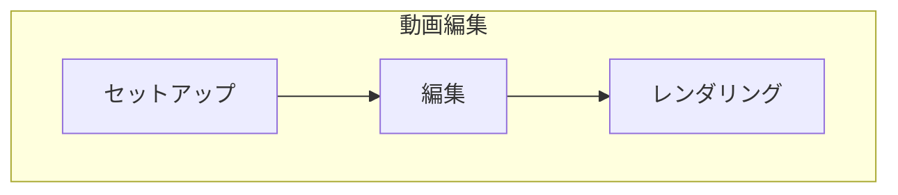
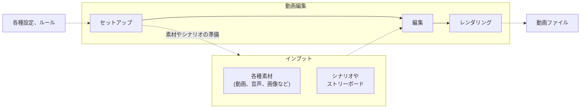
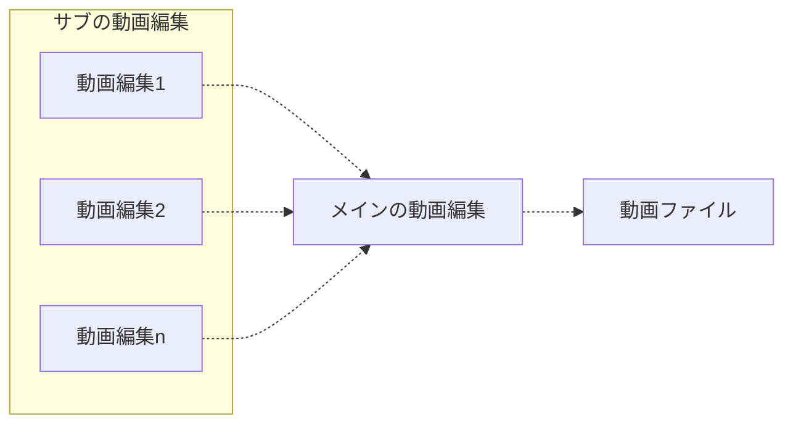

[2. Video Editing — Blender VSE Unofficial Documentation](https://kantas-spike.github.io/vse-docs/video_editing/index.html)をもとに
、Blenderで動画編集するための考え方や準備方法をまとめたいと思います。

<!--more-->

### 動画編集のワークフロー

一般的な動画編集は以下のワークフローで行うようです。



もう少し詳細にしてみると、こんな感じでしょうか。



```column{title="用語説明"}
1. セットアップ

   - 作業環境やプロジェクトを設定したり、必要なものを準備したりして、動画編集作業を開始できるようにします。

2. 編集

   - 素材を編集して1つの作品を作ります。
     - モンタージュ 、エフェクトの追加、カラーグレーディング 、サウンドの編集

3. レンダリング 

   - 編集の結果を、動画ファイル形式(.mp4など)に変換します。

```

大きなプロジェクトはもっと複雑で、他の動画編集作業(サブ)の結果がメインの動画編集作業のインプットになることもあるようです。



### 方針

この記事は数回にわたる連載になります。

**「Blenderの操作説明動画の作成」** を例題として、
[Blender VSE 非公式文書](https://kantas-spike.github.io/vse-docs/index.html)の内容を動画編集ワークフローを体験しながら学んでいきたいと思います。

作成する **「Blenderの操作説明動画」** シナリオ?(コンセプト?)は以下になります。

```column {title="操作説明動画のシナリオ"}
目的: Blenderを起動し、Blenderの動画編集用プロジェクトを作成するまでの手順を説明する。
- 起: Blenderをインストールする
- 承: Blenderを起動する
- 転: Video Editing プロジェクトを選択しプロジェクトを作成する
- 結: Video Editingのワークスペースを確認する
```

また、一度に完全なアウトプットを作ることを目標にするのではなく、
連載のなかで、段階的に何度も繰り返しながらアウトプットを改善していきたいと思います。

まず今回は、最初の繰り返し(1周目)を始めましょう。

### 1周目：セットアップ〜レンダリングまでやってみる

**1周目**の目標は、必要最小限の素材を使って、10秒の短い動画を作成することです。

その中で、 **セットアップ** 、**編集**、**レンダリング** のワークフローを体験していきましょう。

準備として、以下のスクリーンキャプチャ動画が必要になります。

```column{title="必要なもの"}

- **『承: Blenderを起動する』用の動画**

    Blenderアイコンをクリックしてから〜Blenderが起動するまでのもの

OS標準の画面収録ツールを使って、Blenderを起動するまでの動画を作成しておいてください。
```

では、実際にワークフローを体験していきましょう。

### ワークフロー1: セットアップ

セットアップは、以下に分類できそうです。

```column {title="セットアップの分類"}
1. Blenderのセットアップ
    1. 自身の環境や好みあわせて、Blenderのルック&フィールや入力デバイスのエミュレーションなどを設定
    2. 必要ならアドオンを導入
    3. 編集作業のパフォーマンスを改善するための設定(Proxies & cacheの設定。)  
2. プロジェクトのセットアップ
    1. プロジェクトのフォルダーを構成
    2. 編集で使う素材を集める
3. Blenderプロジェクトファイルのセットアップ 
    1. レンダリングにより生成する動画ファイルの解像度やフレームレート、ファイル形式などを設定
    2. レンダリング結果の出力先を設定

```

#### 1. Blenderのセットアップ

変更せずデフォルトのままとします。

#### 2. プロジェクトのセットアップ

- プロジェクト用のフォルダーの作成

  素材やシナリオなど動画編集に関わる全てのデータを、
  今回は、以下のフォルダーで管理します。

  ```column
  **~/wk/1st_cycle**
  ```

- 分類用のサブフォルダーの作成

  プロジェクト用フォルダー内のデータを整理するためのサブフォルダーを作成します。

  フォルダー構成は、[2.1.5. Directory structure — Blender VSE Unofficial Documentation ドキュメント](https://kantas-spike.github.io/vse-docs/video_editing/setup/directory-structure.html) に基本的に従います。

  毎回手動で作成するのは大変なので、一度、一連の空のサブフォルダーを作成し、それをテンプレートとして、各プロジェクトにコピーすると良いかもしれません。

  ````column {title="サブフォルダー構成"}
  ```text
  .
  ├── 1_video
  │   ├── 1_movie
  │   ├── 2_photo
  │   ├── 3_graphic
  │   ├── 4_vfx
  │   └── 5_slide
  ├── 2_audio
  │   ├── 1_dialog
  │   ├── 2_music
  │   ├── 3_sfx
  │   └── 4_slide
  └─── 3_project
      ├── 1_blender
      ├── 2_render
      ├── 3_doc
      ├── 4_voicevox
      └── 5_slide

  ```
  ````

- あらかじめ用意した編集用の素材を格納します。

  ```column {title="使用する素材"}
  - スクリーンキャプチャ動画 (**シナリオの「承」** の部分)を以下に保存

      **~/wk/1st_cycle/1_video/1_movie/01_start_blender.mov**
  ```

#### 3. Blenderプロジェクトファイルのセットアップ

- Blenderの起動

  スプラッシュ画面の **Video Editing** をクリックし、動画編集用のプロジェクトファイルを作成しましょう。

- Blenderプロジェクトファイル(.blendファイル)の保存

  **[File]メニュー > [Save]** を選択し、以下にプロジェクトファイルを保存しましょう。

  ```column{title="プロジェクトファイル"}
  **~/wk/1st_cycle/3_project/1_blender/main.blend**
  ```

- **[Properties]エディター > [Output]タブ** を設定

  以下の項目を設定します。

  ```column {title="動画の形式" icon="⚙️"}
  - [Format]パネル:
    - Resolution X: **1920** px
    - Resolution Y: **1080** px
    - Resolution %: **100** %
    - Frame Rate： **60** fps
  ```

  ```column {title="フレーム範囲" icon="⚙️"}
  - [Frame Range]パネル
    - Frame Start: **1**
    - Frame End: **600**

  レンダリングする動画の長さは 600フレーム (10秒)とします。
  また、 フレーム範囲はあとからでも可能です。編集時に必要に応じて増減できます。
  ```

  ````column {title="出力先とファイル形式" icon="⚙️"}
  - [Output]パネル
    - 出力先のパス

        ```column
        **//../2_render/1st_cycle**
        ```

    - File Format: **FFmpeg Video**
    - Encoding:
      - Container: **MPEG-4**
  ````

  ````column {title="出力先パスの表記について" icon="⚠️"}

  出力先のパス(`//../2_render/1st_cycle`)の先頭にある `"//"` はプロジェクトファイル(.blendファイル)の位置からの相対パスを意味します。

  今回のプロジェクトファイルは、`~/wk/1st_cycle/3_project/1_blender/main.blend` なので、

  出力先のパス(`//../2_render/1st_cycle`)は、以下のフォルダーを指します。

  ```column
  **~/wk/1st_cycle/3_project/2_render/1st_cycle**
  ```


  また、出力先のパス `//../2_render/1st_cycle`のファイル名部分(`1st_cycle`)には拡張子が省略されています。

  拡張子を省略した場合は、**ファイル名** に **開始・終了のフレーム番号** と **拡張子** を付与した名前が採用されます。 

  ```column{title="例: 60フレームの動画の場合"}
  **~/wk/1st_cycle/3_project/2_render/1st_cycle0001-0600.mp4**
  ```

  ````

設定方法の詳細は、[2.1.6. Project settings — Blender VSE Unofficial Documentation ドキュメント](https://kantas-spike.github.io/vse-docs/video_editing/setup/project-settings.html)を参照してください。

### ワークフロー2: 編集

今回は、`01_start_blender.mov` をタイムラインに追加するだけです。

```column
1. 画面左上の **File Browser** に、ディレクトリのパス `//../../1_video/1_movie` を指定しましょう。
2. `01_start_blender.mov`が表示されるはずです。
3. 画面下中央の **Sequencer** の **Playhead** がフレーム1にあることを確認します。
4. 画面上中央の **Preview** に `01_start_blender.mov` をドラッグ&ドロップしましょう。
5. 画面下中央の **Sequencer** の **Playhead** の位置に`01_start_blender.mov`が追加されました。
6. **[Play]ボタン** を押して **Sequencer** のタイムラインを再生してみましょう。
```

今回は、動画を追加するだけで、これ以上編集しません。このままレンダリングします。

本格的な編集方法の詳細は、今後公開予定の記事で説明します。

### ワークフロー3: レンダリング

レンダリングの手順は以下になります。

````column
1. **Topbar** の **[Render]メニュー** > **[Render Animation]** 実行

   - 新しく**Blender Render**画面が表示され、VSEのタイムライン上の各フレームがレンダリングされていきます。
     - 画面の上部には、レンダリング中のフレーム番号や処理時間などの情報が表示されます。
     - 一方、元の **Video Editing** の画面の **Status bar** 部分には、**Sequence Render** プログレスバーが表示されます。

2. レンダリング完了

   レンダリングが完了すると、**Video Editing** の画面の **Status bar** の **Sequence Render** プログレスバーが消えます。

   以下のファイルが生成されているか確認しましょう。

   ```column {title="生成ファイル"}
   **~/wk/1st_cycle/3_project/2_render/1st_cycle0001-0600.mp4**


3. 生成ファイルを動画再生ツールで再生して内容を確認しましょう。
````

以上で、1周目のワークフローが完了しました。

### まとめ

今回は、[Blender VSE 非公式文書](https://kantas-spike.github.io/vse-docs/index.html)の以下の章を中心に、ワークフローとセットアップについて説明しました。

```column
[2.1. セットアップ — Blender VSE Unofficial Documentation](https://kantas-spike.github.io/vse-docs/video_editing/setup/index.html)
```

そして、お試しとしてワークフローに従い、動画を生成しました。

実際に自分でやってみると、理解しやすいと思います。(レンダリングには時間がかかることもわかります。)

最近のOSは画面キャプチャ機能を標準装備しているので、録画した動画を素材として、Blenderの動画編集を試してみましょう。

```footnotes

映画用語で、複数のカットを組合せて作品を作る技法のこと。(参照: [モンタージュ - Wikipedia](https://ja.wikipedia.org/wiki/%E3%83%A2%E3%83%B3%E3%82%BF%E3%83%BC%E3%82%B8%E3%83%A5))


映画などの映像作品で、映像の色彩を補正する作業のこと。(参照: [カラーコレクション - Wikipedia](https://ja.wikipedia.org/wiki/%E3%82%AB%E3%83%A9%E3%83%BC%E3%82%B3%E3%83%AC%E3%82%AF%E3%82%B7%E3%83%A7%E3%83%B3))


コンピューターのプログラムを用いて画像・映像(動画)・音声などを生成すること。 (参考: [レンダリング (コンピュータ) - Wikipedia](<https://ja.wikipedia.org/wiki/%E3%83%AC%E3%83%B3%E3%83%80%E3%83%AA%E3%83%B3%E3%82%B0_(%E3%82%B3%E3%83%B3%E3%83%94%E3%83%A5%E3%83%BC%E3%82%BF)>))


[ハッキングの学び方(How To Learn Hacking)](https://github.com/kantas-spike/how-to-learn-hacking-japanese/blob/main/how-to-learn-hacking.md)の精神です。


私の環境はmacOSなので、[スクリーンショット](https://support.apple.com/ja-jp/guide/mac-help/mh26782/mac)を使って画面を収録しました。


デフォルトの状態でProxies & cacheは自動設定されています。
もっと編集作業のパフォーマンスを改善したい場合は、[2.1.4. Proxies & cache — Blender VSE Unofficial Documentation ドキュメント](https://kantas-spike.github.io/vse-docs/video_editing/setup/proxies.html)を確認してください。


本文書では、Blenderの`.blend`ファイルをプロジェクトファイルと呼んでいます。


お使いの環境にホイールマウスやテンキーがない場合、設定によりエミュレートできます。(参照: [2.1.2. User Preferences — Blender VSE Unofficial Documentation ドキュメント](https://kantas-spike.github.io/vse-docs/video_editing/setup/preferences.html))


2点を修正しています。「1.個人的な好みでフォルダー名を短くする」、「2. スライドベースの画像や音声の利用を想定し`x_slide`を追加」


個人的なツールになりますが、私はスライドベースの動画作用に [kantas-spike/add_slide.py](https://github.com/kantas-spike/add_slide.py)を使ってサブフォルダーをセットアップしています。


詳細は、[2.1.6. Project settings — Blender VSE Unofficial Documentation ドキュメント](https://kantas-spike.github.io/vse-docs/video_editing/setup/project-settings.html)の`Output Path`の項目を参照してください。


レンダリング途中で、**Blender Render**画面を閉じるか、**Sequence Render** プログレスバーを閉じると、レンダリングが中止されます。

```
