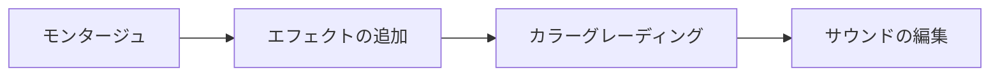

[前回](/portfolio/articles/2024/04/17-blender%E3%81%A7%E5%8B%95%E7%94%BB%E7%B7%A8%E9%9B%86-%E3%83%AF%E3%83%BC%E3%82%AF%E3%82%B9%E3%83%9A%E3%83%BC%E3%82%B9%E3%81%AE%E7%94%A8%E8%AA%9E%E3%81%A8%E5%9F%BA%E6%9C%AC%E6%93%8D%E4%BD%9C/)は、 **ワークスペースの用語と基本操作** について説明しました。

いよいよ **編集** ワークフローについて説明します。

<!--more-->

**編集** ワークフローは以下の作業から構成されるそうです。



そして、今回は、 **編集** ワークフロー の **モンタージュ** から **「ストリップの種類とその追加方法」** について紹介します。

この記事では、[2.2.1.1. ストリップの種類 — Blender VSE Unofficial Documentation ドキュメント](https://kantas-spike.github.io/vse-docs/video_editing/edit/montage/striptypes/index.html) をもとに概要を説明します。

### ストリップの種類

Blenderで利用できるストリップには以下のものがあります。

| No  | ストリップの種類               | 説明                                                              |
| --- | ------------------------------ | ----------------------------------------------------------------- |
| 1   | Scene ストリップ               | 別シーンのデータを表示する                                        |
| 2   | Clip ストリップ                | Movie Clip Editorで作成したTrackingデータを表示する               |
| 3   | Mask ストリップ                | Movie Clip Editorで作成したMaskデータを表示する                   |
| 4   | Movie ストリップ               | 動画ファイルを表示する                                            |
| 5   | Sound ストリップ               | 音声ファイルを再生する                                            |
| 6   | Image/Sequence ストリップ      | 1枚または複数枚から構成される静止画を動画として表示する           |
| 7   | Color ストリップ               | 指定された色を表示する                                            |
| 8   | Text ストリップ                | 字幕を表示する                                                    |
| 9   | Adjustment Layer ストリップ    | 下にある全てのチャンネルを入力として扱えるようにする              |
| 10  | Effect Strip ストリップ(12種)) | 1つまたは複数のストリップに対して効果を設定する(12種類の効果あり) |
| 11  | Transition ストリップ(4種)     | 2つのストリップに対して画面遷移効果をつける                       |

これらのストリップは、4つのグループに分類できます。

|     | 名前              | 説明                                                                             |
| --- | ----------------- | -------------------------------------------------------------------------------- |
| A   | Blender内部ソース | 別のシーンやVSE以外の別のBlenderのエディターで作成したものが入力ソースとなるもの |
| B   | 外部ソース        | 外部ファイルが入力ソースとなるもの                                               |
| C   | VSE内部生成       | Video Sequence Editor(Sequencer ビュー)で作成するもの                            |
| D   | エフェクト        | 別のストリップが入力ソースとなるもの                                             |

ストリップを分類すると以下になるようです。

```rawhtml
<table>
  <thead>
    <tr>
      <th>No</th>
      <th>分類</th>
      <th colspan="2">ストリップ</th>
    </tr>
  </thead>
  <tbody>
    <tr>
      <th rowspan="3">A</th>
      <td rowspan="3">
        Blender内部ソース
      </td>
      <td>1</td>
      <td>Sceneストリップ</td>
    </tr>
    <tr>
      <td>2</td>
      <td>Clipストリップ</td>
    </tr>
    <tr>
      <td>3</td>
      <td>Maskストリップ</td>
    </tr>
    <tr>
      <th rowspan="3">B</th>
      <td rowspan="3">外部ソース</td>
      <td>4</td>
      <td>Movieストリップ</td>
    </tr>
    <tr>
      <td>5</td>
      <td>Soundストリップ</td>
    </tr>
    <tr>
      <td>6</td>
      <td>Image/Sequenceストリップ</td>
    </tr>
    <tr>
      <th rowspan="2">C</th>
      <td rowspan="2">VSE内部生成</td>
      <td>7</td>
      <td>Colorストリップ</td>
    </tr>
    <tr>
      <td>8</td>
      <td>Textストリップ</td>
    </tr>
    <tr>
      <th rowspan="3">D</th>
      <td rowspan="3">エフェクト</td>
      <td>9</td>
      <td>Adjustment Layerストリップ</td>
    </tr>
    <tr>
      <td>10</td>
      <td>Effectストリップ</td>
    </tr>
    <tr>
      <td>11</td>
      <td>Transition</td>
    </tr>
  </tbody>
</table>

```

### セットアップ

実際にストリップ追加したいのですが、その前にプロジェクトファイルやストリップの素材を準備しましょう。

#### プロジェクトファイル

Blenderの **Video Editing** プロジェクトを作成し、
以下のようにプロジェクトファイルを設定します。

今回は、Youtubeショート用(縦長のサイズで、60秒未満)に動画作成する場合を例としています。

```column {title="Output Properties" icon="⚙️"}
  - [Format]パネル:
    - Resolution X: **1080** px
    - Resolution Y: **1920** px
    - Resolution %: **100** %
    - Frame Rate： **60** fps
  - [Frame Range]パネル
    - Frame Start: **1**
    - Frame End: **3570** (59.5秒)
```

#### 外部ソース素材の準備

##### Movie ストリップ用素材

ffmepegで4つのテスト動画を作成します。

1つ目は、60fpsのテスト動画(音声なし)です。

```shell
ffmpeg -f lavfi -i testsrc=duration=10:size=1280x720:rate=60 -vf "format=yuv420p,drawtext=text='60fps':fontcolor=white:fontsize=64:x=max_glyph_w:y=main_h-line_h" ./1_video/1_movie/movie01_60fps_text.mp4
```

2つ目は、30fpsのテスト動画(音声なし)です。

```shell
ffmpeg -f lavfi -i testsrc=duration=10:size=1280x720:rate=30 -vf "format=yuv420p,drawtext=text='30fps':fontcolor=white:fontsize=64:x=max_glyph_w:y=main_h-line_h" ./1_video/1_movie/movie01_30fps_text.mp4
```

3つ目は、60fpsのテスト動画(音声あり)です。音声は440Hzのシグナル音と1秒おきのビープ音です。

```shell
ffmpeg -f lavfi -i testsrc=duration=10:size=1280x720:rate=60 -f lavfi -i sine=frequency=440:beep_factor=2:duration=10 -vf "format=yuv420p,drawtext=text='60fps with Sound':fontcolor=white:fontsize=64:x=max_glyph_w:y=main_h-line_h" ./1_video/1_movie/movie01_60fps_text_sound.mp4
```

4つ目は、30fpsのテスト動画(音声あり)です。音声は440Hzのシグナル音と1秒おきのビープ音です。

```shell
ffmpeg -f lavfi -i testsrc=duration=10:size=1280x720:rate=30 -f lavfi -i sine=frequency=440:beep_factor=2:duration=10 -vf "format=yuv420p,drawtext=text='30fps':fontcolor=white:fontsize=64:x=max_glyph_w:y=main_h-line_h" ./1_video/1_movie/movie01_30fps_text_sound.mp4
```

<!-- 動画で説明 -->

##### Sound ストリップ用素材

ffmepegで440Hzのシグナルと1秒ごとの880Hzビープ音の10秒のテストサウンドを作成します。

```shell
ffmpeg -f lavfi -i sine=frequency=440:beep_factor=2:duration=10 ./2_audio/3_sfx/sine_with_beep.wav
```

<!-- 動画で説明 -->

##### Image/Sequence ストリップ用素材

Image/Sequence ストリップは以下の2種類のストリップの総称です。

- Imageストリップ

  静止画を表示するためのストリップ

- Image Sequence トリップ

  一連の画像ファイル(例: 001.png, 002.png...)から構成される動画ストリップ

Imageストリップは、Image Sequence トリップの画像ファイルが1つのみのバージョンとも言えます。

今回は、[ImageMagick – Create, Edit, Compose, or Convert Digital Images](https://imagemagick.org/index.php) を使ってアルファベットの画像を作成します。

例えば、アルファベットの`A`が描かれた サイズ 800x600 の画像は、以下のコマンドで作成できます。

```shell
magick convert -fill white -background '#4d6890' -size 800x600 -gravity center -pointsize 600  label:A alphabet_01.png
```

上記コマンドを利用して、以下のシェルスクリプトを実行すると、 1秒分(60枚)のアルファベット画像を作成できます。

```shell
OUTPUT_DIR="./1_video/2_photo/alphabets"
[ -d "$OUTPUT_DIR" ] || mkdir -p $OUTPUT_DIR

counter=1
while true
do
  for c in {A..Z}
  do
    if [ $counter -gt 60 ]; then
      break 2
    fi
    magick convert -fill white -background '#4d6890' -size 800x600 -gravity center -pointsize 600  label:$c $OUTPUT_DIR/alphabet_$(printf '%02d' $counter).png
    counter=$((counter+1))
  done
done

```

#### Movieストリップのタイムプロパティー説明用素材の準備

Movie ストリップの 各種Offset の説明用に、アルファベット **A〜J** までの10フレームからなる動画を作成します。

```shell
ffmpeg -r 10 -pattern_type glob -i './1_video/2_photo/alphabets/alphabet_{0*,10}.png' -vcodec libx264 -pix_fmt yuv420p  ./1_video/1_movie/alphabets10.mp4
```

#### 内部ソース素材の準備

##### Scene ストリップ用素材

Blenderには、シーンと呼ばれるデータがあります。
Blenderで作成した3Dオブジェクトやマテリアルなどのデータは、作業しているシーンに保存されます。
同じく、 **Video Sequence Editor** で作成している動画編集のタイムラインも、作業しているシーンに保存されます。

Scene ストリップ は、他のシーンで作成した、3Dオブジェクトや動画編集のタイムラインをストリップとして利用できます。

今回は、別のシーンで作成した、3Dオブジェクトと動画編集のタイムラインのそれぞれの例を作成します。

- 3Dオブジェクト(sample_scene1)
- 動画編集のタイムライン(sample_scene2)

##### Clip ストリップ用素材

Blenderには、作成した3Dオブジェクトと映像を連携させるための **Movie Clip Editor** があります。
Clipストリップは、**Movie Clip Editor**で作成した動画をストリップとして利用できます。

私は、**Movie Clip Editor** を使ったことがないため、説明用として今回は、何の処理も行っていたいダミーの動画を登録しておきます。

```shell
ffmpeg -f lavfi -i testsrc2=duration=10:size=1280x720:rate=60 -vf "format=yuv420p,drawtext=text='60fps':fontcolor=white:fontsize=64:x=max_glyph_w:y=main_h-line_h" ./1_video/1_movie/dummy_clip_60fps_text.mp4
```

##### Mask ストリップ

動画編集では、いろいろな場面でマスクが利用されます。プライバシー保護のため顔や車のナンバーにモザイクを入れたり、グリーンバックのスクリーンからオブジェクトを抽出したり、などです。

<!-- ダミーの登録方法 -->

**Movie Clip Editor** には、マスクを作成するモードがあり、
Maskストリップは、**Movie Clip Editor**で作成したマスクをストリップとして利用できます。

今回はストリップ説明用にダミーのマスクを作成します。

ただし、 **Movie Clip Editor** で作成したマスクは、Maskモディファイア(今後紹介予定)から直接利用できるため、Maskストリップを利用する機会はあまりないかもしれません。

#### VSE内部生成の準備

Color ストリップ と Text ストリップ については、VSE内で作成するため、あらかじめ素材は用意しません。

#### エフェクトの準備

Adjustment Layer ストリップ、Effect Strip ストリップ(10種))、Transition ストリップ(4種)については、
今後、紹介予定の **編集** ワークフロー の **エフェクトの追加** で説明します。

### ストリップの追加方法

ストリップは **[Add]メニュー**から追加できます。(ショートカットキー `Shift+A` からでも追加できます。)

追加時には、配置するチャンネルやフィット方法などの各種オプションを指定できます。

#### 実際に追加してみる

まずは、実際に、各種ストリップを追加していきましょう。
以下の順で説明します。

1.「A. Blender内部ソース」系のストリップ2. 「B. 外部ソース」系のストリップ3. 「C. VSE内部生成」系のストリップ

<!-- 注意!! 最初の動画を追加した場合 -->
<!-- 注意!! 音声つき動画の追加
       - 2つのストリップが追加されます
       - 独立しているので一緒に編集する必要あり
       - 動画はFPSの影響を受けるが、音声は受けない
 -->

各ストリップは色分けされています。

#### 「B. 外部ソース」系のストリップの追加方法

「B. 外部ソース」系のストリップは、[Add]メニュー以外にも以下の追加方法を利用できます。

「B. 外部ソース」系のストリップで利用できる追加方法は以下になります。

1. [Add]メニュー(or `Shift + A`)から追加する方法
2. **File Browser**からドラッグして追加する方法
3. **OSのファイルブラウザ** からドラッグして追加する方法

2,3の方法にはいくつか制限があります。

- 複数のファイルを追加できない。複数ファイルをまとめて追加できるのは **[Add]メニュー(or `Shift + A`)から追加する方法** のみ
- オプション(配置するチャンネルやフィット方法など)を追加時に指定できない。(**Adjust Last Opertaion** で追加後にオプションを変更可能)

```column {title="Movie ストリップ追加時のオプション"}

| オプション           | 説明                                                                                                                     |
| -------------------- | ------------------------------------------------------------------------------------------------------------------------ |
| Relative Path        | ストリップのソースのパスをプロジェクトファイルからの相対パスで保持                                                       |
| Start Frame          | タイムライン上でストリップを配置する位置                                                                                 |
| Channel              | タイムライン上でストリップを配置するチャンネル                                                                           |
| Replace Selection    | タイムラインで選択中のストリップを追加したストリップで置き換える                                                         |
| Fit Method           | プロジェクトのスクリーン解像度と素材の解像度のサイズ調整方法(`Scale to Fit`、`Scale to Fill`, `Stretch to Fill`から選択) |
| Set View Transform   | インポートされた素材の色空間に基づきビュー変換する                                                                       |
| Adjust Playback Rate | プロジェクトのFPSに合せて、素材の長さを維持するように素材のFPSを調整する                                                 |
| Sound                | ムービーのオーディオトラックをSoundストリップとして追加する                                                              |
| Use Movie Frame Rate | プロジェクトのFPSを素材のFPSに設定する                                                                                   |
```

```column {title="Movie ストリップ追加時の注意事項"}

VSE(Sequencerビュー)のタイムラインにストリップが配置されていない時に、最初のMovieストリップを追加した場合、
最初のMovieストリップのフレームレートがプロジェクトのフレームレートに自動的に設定されてしまいます。

プロジェクトファイルの設定でフレームレートに60fpsを設定している場合、30fpsのMovieストリップを最初に追加すると、
プロジェクトファイルの設定が60fpsから30fpsに変更されてしまいます。

これは回避するには、最初に別のストリップ(60fpsのMovieストリップ or Colorストリップなどfpsと関係のないストリップ)を追加してから、
30fpsのMovieストリップを追加する必要があります。

- [2.1.6. Project settings — Blender VSE Unofficial Documentation ドキュメント](https://kantas-spike.github.io/vse-docs/video_editing/setup/project-settings.html)の **Frame Rate** を参照
```

```column {title="Movie ストリップのFPS と Sound ストリップ"}
プロジェクトと異なるFPSのMovieストリップを配置すると、意図した再生速度を再現できません。

一方、SoundストリップにはFPSはないため、プロジェクトのFPSにかかわらず常に同じ速度で再生されます。

例えば、30FPSの音声付き動画を60FPSのプロジェクトに追加すると、映像と音声の速度がズレることになります。
Movieストリップの追加オプション "Adjust Playback Rate"を有効にすると、再生速度が調整されズレを防止できます。
```

### ストリップのプロパティー

VSE(Sequencerビュー)のタイムラインに追加したストリップをクリックすると、Sequencerのサイドバーの **Strip** タブに、ストリップの情報(プロパティー)が表示されます。

ストリップのプロパティーには以下のグループがあります。

| **Strip** タブの構成 | 説明                                                         |
| -------------------- | ------------------------------------------------------------ |
| Header               | 全ストリップで共通の名前、レンダリング有無を設定             |
| Scene                | Sceneストリップ独自のプロパティーを設定                      |
| Mask                 | Maskストリップ独自のプロパティーを設定                       |
| Sound                | サウンド固有のプロパティーを設定                             |
| Effect Strip         | Text、Colorやエフェクト用のプロパティーを設定                |
| Compositing          | 下のチャンネルとのブレンド方法を設定                         |
| Transform            | ストリップの変形用のプロパティーを設定                       |
| Crop                 | ストリップの切り抜き用のプロパティーを設定                   |
| Video                | 動画固有のプロパティーを設定                                 |
| Color                | ストリップの色合いを設定                                     |
| Time                 | ストリップのタイムライン上の位置を設定                       |
| Source               | ストリップのソースのプロパティーを設定                       |
| Custom               | アドオンなどで利用するための独自の情報をストリップに設定する |

Header と Custom は全ストリップで常に表示されますが、
その他のプロパティーは、ストリップにより異なります。

| グループ | ストリップ \ プロパティー | Scene | Mask | Sound | Effect Strip | Compositing | Transform | Crop | Video | Color | Time | Source |
| -------- | ------------------------- | ----- | ---- | ----- | ------------ | ----------- | --------- | ---- | ----- | ----- | ---- | ------ |
| A        | Sceneストリップ           | ○     | -    | -     | -            | ○           | ○         | ○    | ○     | ○     | ○    | -      |
|          | Clipストリップ            | -     | -    | -     | -            | ○           | ○         | ○    | ○     | ○     | ○    | -      |
|          | Maskストリップ            | -     | ○    | -     | -            | ○           | ○         | ○    | ○     | ○     | ○    | -      |
| B        | Movieストリップ           | -     | -    | -     | -            | ○           | ○         | ○    | ○     | ○     | ○    | ○      |
|          | Soundストリップ           | -     | -    | ○     | -            | -           | -         | -    | -     | -     | ○    | ○ +α   |
|          | Image/Sequence ストリップ | -     | -    | -     | -            | ○           | ○         | ○    | ○     | ○     | ○    | ○      |
| C        | Colorストリップ           | -     | -    | -     | ○            | ○           | ○         | ○    | ○     | ○     | ○    | -      |
|          | Textストリップ            | -     | -    | -     | ○            | ○           | ○         | ○    | -     | -     | ○    | -      |

### ストリップの各プロパティーの紹介

実際のストリップを例に、各プロパティーの情報をざっと紹介します。(利用頻度の少なそうなMaskストリップのMaskプロパティーの紹介は省略します。)

個別の紹介の前にまずは、プロパティーの操作方法を紹介します。

#### Movie ストリップ

Movie ストリップのプロパティーをまとめました。
詳細は、[2.2.1.1.1. Movie ストリップ — Blender VSE Unofficial Documentation ドキュメント](https://kantas-spike.github.io/vse-docs/video_editing/edit/montage/striptypes/movie.html)を参照ください。

##### Transform

Transformはストリップのコンテンツを変形するためのプロパティーです。

前回紹介した、プレビューでのコンテンツの操作は、実はTransformプロパティーが操作されています。

Transformのフィールドの値を変えると、プレビューのコンテンツの表示も変りますし、
逆に、プレビューのコンテンツを操作すると、Transformのフィールドの値も変わります。

プレビューでのコンテンツ操作よりも、機能が豊富です。

| プロパティー | 説明                                                  |
| ------------ | ----------------------------------------------------- |
| Position     | コンテンツの位置(X,Y座標)                             |
| Scale        | コンテンツの拡大縮小(X方向,Y方向)                     |
| Rotation     | コンテンツの回転                                      |
| Origin       | コンテンツの変形操作時の基準点(X方向,Y方向の相対位置) |
| Mirror       | コンテンツの反転(X方向、Y方向)                        |
| Filter       | コンテンツ変形時の補間方法                            |

```column {title="プロパティー フィールドの操作方法"}
[Fields - Blender 4.1 Manual](https://docs.blender.org/manual/en/latest/interface/controls/buttons/fields.html)
[Changing multiple Object Data Properties at the same time. : r/blenderhelp](https://www.reddit.com/r/blenderhelp/comments/y68a1l/changing_multiple_object_data_properties_at_the/)

- 値の設定、変更
  - 直接入力
  - 増分ステップ
  - ドラッグによる増分
  - 式として入力も可能です。
- 複数値の編集
- 複数オブジェクトの値編集
```

##### Crop

ストリップのコンテンツを切り抜きます。

| プロパティー | 説明                               |
| ------------ | ---------------------------------- |
| Left         | コンテンツを切り抜く時の左辺の位置 |
| Right        | コンテンツを切り抜く時の右辺の位置 |
| Top          | コンテンツを切り抜く時の上辺の位置 |
| Bottm        | コンテンツを切り抜く時の下辺の位置 |

##### Header

ストリップの名前とレンダリング有無を設定します。

| プロパティー | 説明                                                                                                     |
| ------------ | -------------------------------------------------------------------------------------------------------- |
| Name         | ストリップの名前                                                                                         |
| Mute         | ストリップをレンダリング有無。チェック有はレンダリング **されない**、チェック無はレンダリング **される** |

##### Compositing

ストリップのブレンド方法と不透明度を設定します。

| プロパティー | 説明                                                             |
| ------------ | ---------------------------------------------------------------- |
| Blend        | 現在のストリップを下位のチャンネルのストリップとブレンドする方法 |
| Opacity      | ストリップの不透明度                                             |

##### Time

ストリップのタイムライン上の位置を設定します。

| プロパティー                   | 説明                                                                                          |
| ------------------------------ | --------------------------------------------------------------------------------------------- |
| Lock (Panelヘッダーのアイコン) | ストリップのタイムライン上での移動、長さ調整を禁止                                            |
| Show Retiming Keys             | Retiming Keys操作用のコントロールの表示                                                       |
| Channel                        | ストリップを配置するチャンネル番号                                                            |
| Start                          | タイムライン上でのストリップの開始フレーム番号                                                |
| Duration                       | ストリップの長さ(フレーム数)                                                                  |
| End                            | タイムライン上でのストリップの終了フレーム番号(修正不可. StartとDurationの値により決定される) |
| Strip Offset Start/End         | プレビューに表示するストリップの長さを調整(FV/LVマーカーの位置を変更)                         |
| Hold Offset Start/End          | ストリップで利用できるフレームの範囲を調整(FA/LAマーカーの位置を変更)                         |

<!-- 専門用語解説 imagemagickで画像作成 -->

「B. 外部ソース」系のストリップは、もとのソースファイルとの位置も意識する必要があるため少し複雑です。

そのため、「B. 外部ソース」系のストリップの Timeプロパティーを理解しやすくするために、説明用にストリップに4つのマーカーを導入します。

| マーカー名             | 略称   | 説明                                                                     |
| ---------------------- | ------ | ------------------------------------------------------------------------ |
| First accessible frame | **FA** | ストリップが利用できる最初フレーム。通常は動画ファイルの最初のフレーム   |
| First visible frame    | **FV** | プレビューに実際に表示される、ストリップ最初のフレーム。ストリップの先頭 |
| Last visible frame     | **LV** | プレビューに実際に表示される、ストリップ最後のフレーム。ストリップの末尾 |
| Last accessible frame  | **LA** | ストリップが利用できる最後フレーム。通常は動画ファイルの最後のフレーム   |

アルファベット26文字を各フレームにもつ26フレーム分の長さの動画ファイルを用意しました。
この26フレームの動画を例に、Movieストリップの Timeプロパティーについて説明します。

<!-- 実例 -->

<!-- ストリップの操作方法は、次回以降に説明予定ですが、ここでは、Timeプロパティーを理解するため、先行して紹介します。

Blenderのストリップには、左右にハンドルがあり、ストリップを伸縮できます。
ストリップを伸縮すると、**FV**/**LV** は移動します。そして、**FA**/**LA** に変更はありません。

ただ、ストリップをストリップを伸ばす場合、**FV**/**LV** が、**FA**や**LA**の範囲を超える場合があり、その場合以下のルールに従います。

| 条件               | ルール                                             |
| ------------------ | -------------------------------------------------- |
| FVがFAを超える場合 | 追加されるフレームには、FAのフレームがコピーされる |
| LVがLAを超える場合 | 追加されるフレームには、LAのフレームがコピーされる |

**FA**/**LA**は通常、ソースファイルの最初/最後のフレームになります。
しかし、Blenderには2種類のストリップ分割方法があり、**Hold Split** で分割すると **FA**/**LA** が変更されます。

| ストリップ分割方法 | 種別          | 説明                                                                                               |
| ------------------ | ------------- | -------------------------------------------------------------------------------------------------- |
| **Split**          | **FV**/**LV** | 分割した左側のストリップの**LV**を分割位置に設定、分割した右側のストリップの**FV**を分割位置に設定 |
|                    | **FA**/**LA** | **FA**/**LA** を変更せずストリップを分割する                                                       |
| **Hold Split**     | **FV**/**LV** | 分割した左側のストリップの**LV**を分割位置に設定、分割した右側のストリップの**FV**を分割位置に設定 |
|                    | **FA**/**LA** | 分割した左側のストリップの**LA**を分割位置に設定、分割した右側のストリップの**FA**を分割位置に設定 |
 -->

##### Source

ストリップのソースの情報を設定します。

| プロパティー       | 説明                                                         |
| ------------------ | ------------------------------------------------------------ |
| File Path          | ストリップの素材ファイルのパス                               |
| Color Space        | 素材ファイルのカラースペース                                 |
| Alpha Mode         | アルファチャンネルのモード(アルファチャンネルを持つ素材のみ) |
| Stream Index       | 使用するストリームの番号(movieストリップの場合のみ)          |
| Deinterlace        | ビデオファイルのインターレースフィールドを削除               |
| Source Information | 素材の解像度やFPSを表示                                      |

##### Video

動画再生方法を設定します。

<!-- Video と Color は 動画なしで飛ばす -->

| プロパティー   | 説明                                                     |
| -------------- | -------------------------------------------------------- |
| Strobe         | 指定したフレームごとに再生(例: 10を指定時は、1,11,21...) |
| Reverse Frames | 逆順に再生                                               |

##### Color

ストリップの色合いを調整します。

| プロパティー     | 説明                                       |
| ---------------- | ------------------------------------------ |
| Saturation       | 彩度を調整                                 |
| Multiply         | 色を指定倍する(輝度が上る)                 |
| Multiply Alpha   | オプション有効時、色と不透明度を指定倍する |
| Convert to Float | 色を小数データに変換する                   |

#### Sound ストリップ

Sound ストリップのプロパティーをまとめました。
詳細は、[2.2.1.1.2. Sound ストリップ — Blender VSE Unofficial Documentation ドキュメント](https://kantas-spike.github.io/vse-docs/video_editing/edit/montage/striptypes/sound.html)を参照ください。

##### Sound

サウンドに関するプロパティーを設定する。

| プロパティー     | 説明                                                             |
| ---------------- | ---------------------------------------------------------------- |
| Volume           | 音量を調整                                                       |
| Pan              | マルチチャンネルのオーディオを出力するスピーカーの場所を調整する |
| Display Waveform | オーディオの波形を表示する                                       |
| Mono             | オーディオの複数チャンネルを1つのチャンネルにまとめる(モノラル)  |

##### Source (Options for Sound Strips)

| プロパティー       | 説明                                                  |
| ------------------ | ----------------------------------------------------- |
| Sound              | プロジェクトファイルに登録されているSoundデータを選択 |
| File Path          | ストリップの素材ファイルのパス                        |
| Pack               | Soundデータをプロジェクトファイル内に保存する         |
| Caching            | Soundデータをメモリにキャッシュする                   |
| Source Information | 素材のサンプルレートやチャンネル数を表示              |

#### Sceneストリップ

Scene ストリップのプロパティーをまとめました。
詳細は、[2.2.1.1.5. Scene ストリップ — Blender VSE Unofficial Documentation ドキュメント](https://kantas-spike.github.io/vse-docs/video_editing/edit/montage/striptypes/scene.html)を参照ください。

##### Scene

| プロパティー | 説明                                                                   |
| ------------ | ---------------------------------------------------------------------- |
| Scene        | プロジェクトファイルに登録されているSceneを選択                        |
| Input        | 選択したシーンから使用するソースを選択する(Camera、Sequencer から選択) |
| Camera       | シーンで使用するカメラを切替える                                       |
| Annotation   | アノテーションを表示する                                               |
| Transparent  | シーンの背景を透明にする                                               |

#### Colorストリップ

Color ストリップのプロパティーをまとめました。
詳細は、[2.2.1.1.6. Color ストリップ — Blender VSE Unofficial Documentation ドキュメント](https://kantas-spike.github.io/vse-docs/video_editing/edit/montage/striptypes/color.html)を参照ください。

##### Effect Strip (Color)

| プロパティー | 説明         |
| ------------ | ------------ |
| Color        | 色を選択する |

#### Textストリップ

Text ストリップのプロパティーをまとめました。
詳細は、[2.2.1.1.8. Text ストリップ — Blender VSE Unofficial Documentation ドキュメント](https://kantas-spike.github.io/vse-docs/video_editing/edit/montage/striptypes/text.html)を参照ください。

##### Effect Strip (Text)

| プロパティー | 説明                                                            |
| ------------ | --------------------------------------------------------------- |
| Text         | ストリップに表示する文字列                                      |
| Wrap Width   | 文字列を途中改行する長さをスクリーン幅の比率で指定。            |
| Font         | フォントの種類                                                  |
| Size         | フォントサイズ                                                  |
| Color        | フォント色                                                      |
| Shadow       | テキストに影をつける                                            |
| Box          | テキストのボックス背景をつける                                  |
| Box Margin   | ボックス背景のマージン                                          |
| Location     | テキストを配置する位置をスクリーンのサイズの相対位置(x,y)で指定 |
| Anchor       | テキストを配置する時のアンカー(x, y)をLeft,Center,Rightから選択 |

### 参考URL

- Blender公式リファレンス
  - [Blender 4.1 Manual](https://docs.blender.org/manual/en/latest/)
- Blender VSE Unofficial Docs

  - [Blender VSE Unofficial Docs — Blender VSE Unofficial Documentation documentation](https://vse-docs.readthedocs.io/)
  - 日本語訳
    - [Blender VSE 非公式文書 — Blender VSE Unofficial Documentation ドキュメント](https://kantas-spike.github.io/vse-docs/)
    - [2.2.1.1. ストリップの種類 — Blender VSE Unofficial Documentation ドキュメント](https://kantas-spike.github.io/vse-docs/video_editing/edit/montage/striptypes/index.html)

- テスト動画の作成方法
  - [動画編集のためのBlender ストリップの種類とその追加方法 | kanta's spike](https://kantas-spike.github.io/portfolio/articles/2024/04/18-blender%E3%81%A7%E5%8B%95%E7%94%BB%E7%B7%A8%E9%9B%86-%E3%82%B9%E3%83%88%E3%83%AA%E3%83%83%E3%83%97%E3%81%AE%E7%A8%AE%E9%A1%9E%E3%81%A8%E3%81%9D%E3%81%AE%E8%BF%BD%E5%8A%A0%E6%96%B9%E6%B3%95/)
