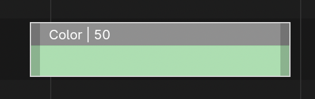
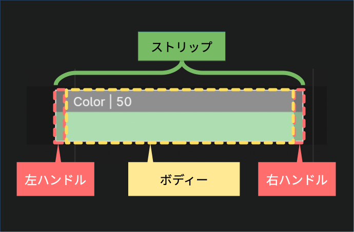
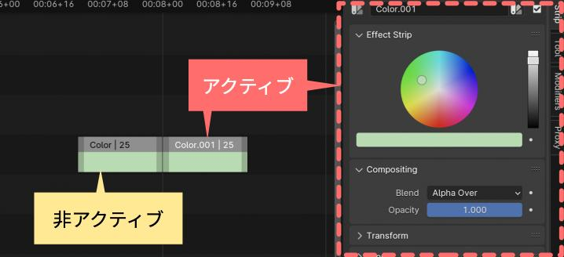
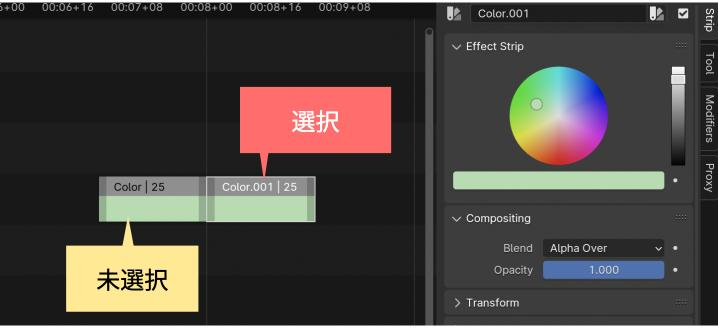
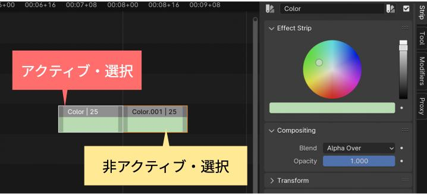
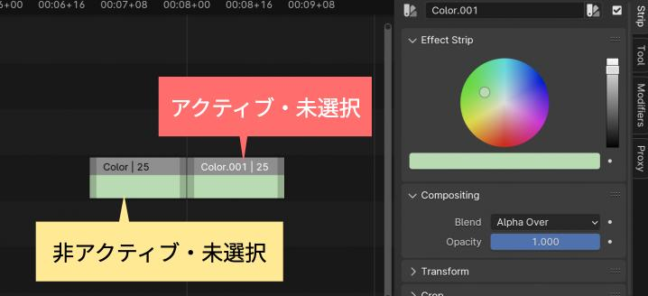

[2. Video Editing — Blender VSE Unofficial Documentation](https://kantas-spike.github.io/vse-docs/video_editing/index.html)をもとに
、ストリップの操作について説明します。

<!--more-->

今回説明する操作は以下の7つです。

|     | 操作名  | 説明                                                                       |
| --- | ------- | -------------------------------------------------------------------------- |
| 1   | Select  | ストリップを選択する操作。ストリップのパーツ選択や、複数のストリップを選択 |
| 2   | Trim    | ストリップの長さを変更する操作                                             |
| 3   | Split   | ストリップを分割する                                                       |
| 4   | Remove  | ストリップを削除する                                                       |
| 5   | Move    | ストリップを移動する                                                       |
| 6   | Copy    | ストリップをコピーする                                                     |
| 7   | Disable | ストリップの非表示やストリップのロックについて説明                         |

<!-- ざっくり説明動画 -->

### 用語解説

ストリップの操作を説明する前に、まず、ストリップの各パーツの名称を紹介します。

以下のカラーストリップを例にします。



ストリップをよく見ると左右の両端に色の暗い部分があります。
この部分をハンドルと呼びます。

ハンドルの内側の部分をボディーと呼びます。



| パーツ名 | 説明                                                 |
| -------- | ---------------------------------------------------- |
| ハンドル | ドラッグすることで、ストリップの長さを調整できます。 |
| ボディー | ドラッグすることで、ストリップ全体を移動できます。   |

### Select(選択)

ストリップを選択する操作です。選択したストリップが Remove, Move, Copy、Disable といった編集操作の対象になります。

<!-- 編集操作例 動画 -->

選択操作の具体的な説明の前に、ストリップの選択状態について説明します。

#### ストリップの選択状態

ストリップには、アクティブ状態と選択状態の2種類の選択に関連する状態があります。

- アクティブ状態

| アクティブ状態 | ストリップの見た目                 | 説明                                           |
| -------------- | ---------------------------------- | ---------------------------------------------- |
| アクティブ     | ストリップ内のテキストは白色で表示 | ストリップがSidebarのStripタブに表示される。   |
| 非アクティブ   | ストリップ内のテキストは黒色で表示 | ストリップがSidebarのStripタブに表示されない。 |

以下の例では、**白色で名前が表示**されている右側のストリップが**アクティブ**です。
左側のストリップは非アクティブのため、黒色で名前が表示されます。

アクティブなストリップの情報がSidebarに表示されます。



- 選択状態

| 選択状態 | ストリップの見た目               | 説明                                         |
| -------- | -------------------------------- | -------------------------------------------- |
| 選択     | ストリップの周りに枠線が付く     | 編集操作(移動や削除など)の処理対象となる     |
| 未選択   | ストリップの周りに枠線が付かない | 編集操作(移動や削除など)の処理対象とならない |

以下の例では、**枠線が表示**されている右側のストリップが**選択**されています。
枠線のない右側のストリップは**未選択**です。



この2種類の状態が組み合せにより、編集対象が決まります。

| アクティブ x 選択      | ストリップの見た目           | 説明                                              |
| ---------------------- | ---------------------------- | ------------------------------------------------- |
| アクティブ ・ 選択     | テキスト白色、枠線白色       | Sidebarに表示。編集操作の処理対象                 |
| アクティブ ・ 未選択   | テキスト白色、枠線なし       | Sidebarに表示。編集操作の処理対象ではない         |
| 非アクティブ ・ 選択   | テキスト黒色、枠線オレンジ色 | Sidebarに表示されない。編集操作の処理対象         |
| 非アクティブ ・ 未選択 | テキスト黒色、枠線なし       | Sidebarに表示されない。編集操作の処理対象ではない |

以下の例では、左側のストリップは **アクティブかつ選択** 状態です。**白色の枠線**があり、白色で名前が表示されています。
一方、右側のストリップは **非アクティブかつ選択** 状態です。**オレンジの枠線**があり、黒色で名前が表示されています。



以下の例では、左側のストリップは **非アクティブかつ未選択** 状態です。枠線がなく、黒色で名前が表示されています。
一方、右側のストリップは **アクティブかつ未選択** 状態です。枠線がなく、白色で名前が表示されています。



ボディーやハンドルといったストリップのパーツ選択や、複数のストリップを選択する操作について説明します。

#### 1つのストリップの選択

| 操作名           | 方法                                   | 説明                                                   |
| ---------------- | -------------------------------------- | ------------------------------------------------------ |
| ストリップの選択 | ストリップのボディー部分を **左Click** | クリックしたストリップが選択されアクティブになります。 |

#### 複数のストリップの選択

| 操作名              | 方法                                                                                                                       | 説明                                                                                                                                                                                                                                                                                                                                                         |
| ------------------- | -------------------------------------------------------------------------------------------------------------------------- | ------------------------------------------------------------------------------------------------------------------------------------------------------------------------------------------------------------------------------------------------------------------------------------------------------------------------------------------------------------ |
| 個別に追加選択      | **Shift+左Click**                                                                                                          | Shiftキーを押しながら左クリックすると、ストリップを選択できます。最後にクリックしたストリップがアクティブになります。選択されたストリップを解除するには、再度、Shiftキーを押しながら左クリックすると解除できます。(ストリップがアクティブでない場合は、Shift+左クリックし、ストリップをアクティブに変更後、再度、Shift+左クリックすると、選択解除できます。) |
| 全選択              | **[Select]メニュー > [All]** or **Aキー**                                                                                  | タイムラインにある全てのストリップを選択する。最後にアクティブだったストリップが再びアクティブになる。                                                                                                                                                                                                                                                       |
| 全選択解除          | **[Select]メニュー > [None]** or **Alt+A** or **A を素早く2回タイプ** or **タイムラインのストリップがないエリアを左Click** | タイムライン内の全てのストリップを選択解除する。                                                                                                                                                                                                                                                                                                             |
| 選択の反転          | **Ctrl+I** or **[Select]メニュー > [Invert]**                                                                              | 現在選択されているストリップの状態を反転する。                                                                                                                                                                                                                                                                                                               |
| ストリップのBox選択 | **Bキー** or **[Select]メニュー > [Box Select]** or **左ドラッグによる矩形選択**                                           | 矩形選択すると、矩形の選択範囲と交差するすべてのストリップが選択される。                                                                                                                                                                                                                                                                                     |

#### 場所に基づいたストリップの選択

##### Playheadの位置に基づいた選択

| 操作名                         | 操作                                                                                                                         | 説明                                                                                           |
| ------------------------------ | ---------------------------------------------------------------------------------------------------------------------------- | ---------------------------------------------------------------------------------------------- |
| Playhead左側の全選択           | **`[`キー** or **[Select]メニュー > [Side of Frame] > [Left]** or **タイムライン上のPlayheadの左側のエリアで Ctrl+左Click**  | Playheadの左側のすべてのストリップが選択される。ただし、Playhead上のストリップは選択されない。 |
| Playhead右側の全選択           | **`]`キー** or **[Select]メニュー > [Side of Frame] > [Right]** or **タイムライン上のPlayheadの右側のエリアで Ctrl+左Click** | Playheadの右側のすべてのストリップが選択される。ただし、Playhead上のストリップは選択されない。 |
| Playhead上のストリップを全選択 | **[Select]メニュー > [Side of Frame] > [Current]**                                                                           | Playheadと重なるすべてのストリップを選択する。                                                 |

##### チャンネル内のストリップの選択

| 操作名                       | 操作                                            | 説明                                                                             |
| ---------------------------- | ----------------------------------------------- | -------------------------------------------------------------------------------- |
| チャンネルの左側の全選択     | **[Select]メニュー > [Channel] > [Left]**       | 選択されたストリップと同じチャンネルの左側にあるすべてのストリップを選択する     |
| チャンネルの右側の全選択     | **[Select]メニュー > [Channel] > [Right]**      | 選択されたストリップと同じチャンネルの右側にあるすべてのストリップを選択する     |
| チャンネルの左右両側の全選択 | **[Select]メニュー > [Channel] > [Both Sides]** | 選択されたストリップと同じチャンネルの左右両側にあるすべてのストリップを選択する |

##### リンクされたストリップの選択

| 操作名                                   | 操作                                                      | 説明                                                                               |
| ---------------------------------------- | --------------------------------------------------------- | ---------------------------------------------------------------------------------- |
| 水平方向に連結しているストリップの全選択 | **Ctrl+Lキー** or **[Select]メニュー > [Linked] > [All]** | 選択されたストリップと水平方向に連結しているすべてのストリップを選択する           |
| 開始・終了時刻が同じストリップの全選択   | **Ctrl+左クリック**                                       | クリックされたストリップと開始・終了時刻が同じであるすべてのストリップをを選択する |

#### 属性ベースのストリップの選択

| 操作名                       | 操作                                                                                                | 説明                                                             |
| ---------------------------- | --------------------------------------------------------------------------------------------------- | ---------------------------------------------------------------- |
| 属性が同じストリップの全選択 | **Shift+Gキーで表示されるメニューから属性を選択** or **[Select]メニュー > [Grouped]から属性を選択** | アクティブストリップと同じ属性をもつすべてのストリップを選択する |

メニューから選択できる属性は以下になります。

| 属性名        | 説明                                                                                                               |
| ------------- | ------------------------------------------------------------------------------------------------------------------ |
| Type          | アクティブなストリップと同じタイプのすべてのストリップを選択する                                                   |
| Global Type   | アクティブなストリップと同じグローバルタイプ(オーディオ or オーディオ以外)のすべてのストリップを選択する           |
| Effect Type   | アクティブなストリップと同じエフェクトタイプ(エフェクト or エフェクト以外)のすべてのストリップを選択する           |
| Data          | アクティブなストリップと同じソース(ファイル、シーン、ムービークリック or マスク)を持つすべてのストリップを選択する |
| Effect        | アクティブなストリップに適用されているエフェクトと同じ種類のエフェクトが適用されているすべてのストリップを選択する |
| Effect/Linked | アクティブなストリップの影響を受ける他のストリップを選択します?? (意味不明)                                        |
| Overlap       | アクティブなストリップとタイムライン上でオーバーラップ(一部のみ or 完全)しているすべてのストリップを選択する       |

ここまでは、ストリップ全体を選択する方法を説明してきました。次はハンドルの選択方法について説明します。

#### ハンドルの選択

| 操作名                                         | 操作                                                                      | 説明                                                                                                                                                                                                            |
| ---------------------------------------------- | ------------------------------------------------------------------------- | --------------------------------------------------------------------------------------------------------------------------------------------------------------------------------------------------------------- |
| ハンドルを選択                                 | ハンドル付近を **左Click**                                                | クリックしたハンドルが選択されます。(ハンドル部分が白色に変ります。) また、該当ハンドルのストリップは選択されアクティブになります。                                                                             |
| ハンドルを追加選択                             | ハンドル付近を **Shift+左Click**                                          | クリックしたハンドルが追加選択されます。(アクティブストリップのハンドル部分は白色に、アクティブでないストリップのハンドルはオレンジに変ります。) また、該当ハンドルのストリップは選択されアクティブになります。 |
| ハンドルを選択(メニュー)                       | ストリップを選択後に、**[Select] > [Handle]**                             | ストリップが短くハンドルをクリックしにくい場合などに利用します。事前にストリップを選択しておく必要があります。                                                                                                  |
| ハンドルのBox選択                              | **Ctrl + Bキー** or **[Select]メニュー > [Box Select (Include Handles)]** | 矩形選択すると、矩形の選択範囲と交差するすべてのハンドルが選択されます。                                                                                                                                        |
| ハンドルに隣接するハンドルを選択               | ハンドル付近を **Alt+左Click**                                            | クリックしたハンドルと、それに隣接するハンドルを選択する                                                                                                                                                        |
| ストリップの両ハンドルに隣接するハンドルを選択 | ストリップのボディーを **Alt+左Click**                                    | クリックしたストリップと、それらに隣接するハンドルを選択する                                                                                                                                                    |

```column {title="選択されたストリップのプロパティーをまとめて変更する方法"}
これまでの説明で、複数のストリップを選択する方法がわかりました。
そうなると、複数のストリップのプロパティーをまとめて変更する方法が知りたくなります。

既に説明した通り、複数のストリップが選択されている場合でも、Sidebarには、アクティブなストリップのプロパティーのみが表示されます。

Sidebarのプロパティーのフィールドを右クリックし、 **コンテキストメニュー > [Copy to Selected]** を選ぶと、該当フィールドの値が、選択されているすべてのストリップに反映されます。

また、Sidebarのプロパティーのフィールドの値を入力し、**Alt+Enterキー** を押すと、該当フィールドの値が、選択されているすべてのストリップに反映されます。
```

<!--
- プロパティーの編集方法の復習
  - 個別フィールド編集
  - 複数フィールドまとめて編集
  - 複数ストリップのフィールド編集
 -->

### Trim(長さ調整)

ハンドルの操作により、ストリップの長さを変更する操作です。

MovieストリップやSoundストリップなどデータソースを持つストリップの場合は、ハンドル操作により**Strip Offset**プロパティーが更新され、その結果ストリップの長さが伸縮します。

一方、ColorストリップやTextストリップなどデータソースを持たないストリップの場合は、ハンドル操作により **Start**プロパティーや**Duration**プロパティーが直接更新され、その結果ストリップの長さが伸縮します。

#### ストリップの長さの変更

Sidebarの **Timeパネル** を設定する以外の方法でもストリップの長さの変更できます。

| 操作名                   | 操作                                                                                              | 説明                                                                                                                                                                                                                                                                                                                                                                                                                                                                                                                                                                                                              |
| ------------------------ | ------------------------------------------------------------------------------------------------- | ----------------------------------------------------------------------------------------------------------------------------------------------------------------------------------------------------------------------------------------------------------------------------------------------------------------------------------------------------------------------------------------------------------------------------------------------------------------------------------------------------------------------------------------------------------------------------------------------------------------- |
| ハンドルのドラッグ       | **ハンドルを左Drag**                                                                              | ドラッグにあわせてストリップが伸縮する                                                                                                                                                                                                                                                                                                                                                                                                                                                                                                                                                                            |
| ハンドルのグラブ         | ハンドルを選択後、 **Gキー** でグラブ状態に                                                       | グラブ状態に設定後ははマウスカーソルの位置にあわせてストリップが伸縮する。ストリップの長さを確定するには、**Enterキー** or **Spaceキー** を押すか **左Click** する。キャンセルする場合は **Escキー**を押すか **右Click** する                                                                                                                                                                                                                                                                                                                                                                                     |
| ストリップのエクステンド | ストリップを選択後、**Eキー** or **[Strip]メニュー>[Transform]>[Move/Extend from Current Frame]** | Playheadの位置に応じて、選択されたストリップを **移動** または **長さを伸縮** します。 Playheadが選択したストリップの範囲外にある場合、マウスカーソルの位置にあわせてストリップが移動します(確定、キャンセル方法はグラブと同様)。 Playheadが選択したストリップの範囲内にある場合、エクステンド開始時のマウスカーソルの位置により動作が変ります。 マウスカーソルがPlayheadの左側にあった場合は、マウスカーソルの動きにあわせてストリップの左側が伸縮します。マウスカーソルがPlayheadの右側にあった場合は、マウスカーソルの動きにあわせてストリップの右側が伸縮します(どちらも確定、キャンセル方法はグラブと同様)。 |

#### Slip Strip Contents

| 操作名             | 操作                                                                   | 説明                                                                                                                                                                                                                                       |
| ------------------ | ---------------------------------------------------------------------- | ------------------------------------------------------------------------------------------------------------------------------------------------------------------------------------------------------------------------------------------ |
| スリップコンテンツ | **Sキー** or **[Strip]メニュー > [Transform] > [Slip Strip Contents]** | マウスカーソルの左右の移動により、ストリップの長さは変更せずに、ストリップのオフセット位置のみ変更する。確定する場合は **Enterキー** or **Spaceキー** を押すか **左Click** する。キャンセルする場合は **Escキー**を押すか **右Click** する |

#### トリミングのクリア

ストリップのトリミングした結果は、Strip Offsetプロパティーに保持されます。
ストリップをトリミング前の状態に戻すには、Strip Offsetプロパティーを0に設定します。

また、**Alt+Oキー** or **[Strip]メニュー>[Transform]>[Clear Strip Offset]** を選択すると、Strip Offsetプロパティーを0に設定します。

```column {title="精密なトリミング"}

トリミングした結果を確認するには、トリミング後に毎回プレイヘッドを移動して確認する必要があります。面倒ですよね。

プレビューの **[View]メニュー > [Preview during Transform]** を有効にすると、トリミング操作中のハンドルの位置のフレームが一時的にプレビューに表示されるので、細かい調整が可能になります。

これにより、効率的にトリミングを行えます。
```

### Split(分割)

ストリップを分割する操作です。

2種類のSplit方法があります。

| 操作名     | 操作                                                  | 説明                                                                                                                                             |
| ---------- | ----------------------------------------------------- | ------------------------------------------------------------------------------------------------------------------------------------------------ |
| Split      | **Kキー** or **[Strip]メニュー > [Split]**            | Playhead の位置でストリップを分割します。**Split**は、もとのストリップを複製し、それぞれ、Playheadの位置にトリムして並べたものと同じになります。 |
| Hold Split | **Shift+Kキー** or **[Strip]メニュー > [Hold Split]** | Playhead の位置でストリップを分割します。**Hold Split** は **Hold Offset** の位置を変更します。                                                  |

#### フリーズフレーム

**Split** と **Hold Split** の使い分けの例として、

[Freeze-frame shot - Wikipedia](https://en.wikipedia.org/wiki/Freeze-frame_shot#:~:text=In%20film%20and%20video%2C%20a,that%20resembles%20a%20still%20photograph.) という編集手法を紹介します。

**Freeze frames** とは、ムービーの中で、一部シーンを静止画にすることで、シーンを強調させる手法です。

Wikipediaでは、**Freeze frames** を使用した映画の例として、 [明日に向って撃て! - Wikipedia](https://ja.wikipedia.org/wiki/%E6%98%8E%E6%97%A5%E3%81%AB%E5%90%91%E3%81%A3%E3%81%A6%E6%92%83%E3%81%A6!) が紹介されています。

**明日に向って打て!** では、主人公の2人が、絶対絶命の状況から銃も構えて外へ飛び出すところで、静止画になるようです。

サンプル動画を例に、 **明日に向って打て!** を再現しましょう。

<!-- Splitを遣った例 Hでカットしてもフリーズフレームにできない -->
<!-- Hold Splitを遣った例 Hでカットしてもフリーズフレームにできる -->

```column {title="Split時のマウスカーソルの位置と選択状態"}
ショートカットキー **Kキー**(Split) や **Shift+Kキー**(Hold Split)を使って Split した時に、
Playheadのどちら側に マウスカーソルがあるかによって、ストリップ分割後のストリップの選択状態が変わります。

| Split or Hold Split 時のカーソルの位置 | 説明                                                                                                                             |
| -------------------------------------- | -------------------------------------------------------------------------------------------------------------------------------- |
| マウスカーソルがPlayheadの右側         | 分割後の右側のストリップは **非アクティブで選択** になります。逆に、分割後の左のストリップは **アクティブで未選択** になります。 |
| マウスカーソルがPlayheadの左側         | 分割後の左側のストリップは **非アクティブで選択** になります。逆に、分割後の右のストリップは **アクティブで未選択** になります。 |

これは動作は、ストリップの不要な部分を削除する時に便利です。

ショートカットキー **Kキー**(Split) や **Shift+Kキー**(Hold Split)で分割後に、右側or左側の不要なストリップを削除したい場合、
Playheadの右or左にマウスカーソルを配置し、ショートカットキー **Kキー**(Split) や **Shift+Kキー**(Hold Split)をタイプします。
そして、そのまま、**Delete** 操作(**Xキー**)をすれば、 **非アクティブで選択** ストリップがそのまま削除されます。
```

### Remove(削除)

| 操作名 | 操作                                                                               | 説明                               |
| ------ | ---------------------------------------------------------------------------------- | ---------------------------------- |
| 削除   | **Xキー** or **[Strip]メニュー > [Delete]** or **コンテキストメニュー > [Delete]** | 選択されたストリップを削除します。 |

### Move(移動)

ストリップを移動します。

| 操作名   | 操作                                                | 説明                                                                                                                                                                                                                                                                                                                               |
| -------- | --------------------------------------------------- | ---------------------------------------------------------------------------------------------------------------------------------------------------------------------------------------------------------------------------------------------------------------------------------------------------------------------------------- |
| ドラッグ | **左ドラッグ**                                      | 1つまたは複数のストリップを選択し、新しい場所にマウスの左ボタンでドラッグします。ストリップはマウスの左ボタンをはなした位置に配置されます。また、ドラッグ中に、**Escキー** や **右クリック** すると移動がキャンセルされます。                                                                                                      |
| グラブ   | **Gキー** or **[Strip]メニュー>[Transform]>[Move]** | 1つまたは複数のストリップを選択し、**Gキー**や **[Strip]>[Transform]>[Move]** を選択すると、ストリップがグラブ状態になり、マウスカーソルを動かして移動できます。目的の位置までマウスカーソルを移動し確定(**Enter** or **Space** or **左クリック**)します。 確定前に **Escキー** や **右クリック** すると移動がキャンセルされます。 |

#### ドラッグやグラブの修飾キー

| 修飾キー               | 説明                                                                                                                                                                                                                                 |
| ---------------------- | ------------------------------------------------------------------------------------------------------------------------------------------------------------------------------------------------------------------------------------ |
| **Xキー** or **Yキー** | ストリップが **左ドラッグ中** や **グラブ状態** の時に、**Xキー** や **Yキー** を1度押すと、移動方向をそれぞれ **水平方向** や **垂直方向** に限定できます。                                                                         |
| **Shiftキー**          | ストリップが **左ドラッグ中** や **グラブ状態** の時に、**Shiftキー** を押し続けると、ストリップの移動量が小さくなり、細かい移動ができます。                                                                                         |
| **Ctrlキー**           | ストリップが **左ドラッグ中** や **グラブ状態** の時に、**Ctrlキー** を押し続けると、スナップ設定の有効・無効が切り替わります。デフォルトでスナップを無効にしている場合は、**Ctrlキー** を押している間だけスナップが有効になります。 |

```column {title="Snapping"}
ストリップを移動する際に、他のストリップと開始位置や終了位置を揃えたい場合があります。
スナップ機能を利用すると、ストリップの位置を揃えやすくなります。

Sequencerのヘッダー部にある磁石のマークを有効にすると、グラブやドラッグによりストリップを移動させると、他のストリップの端やPlayheadに近づく [^2] と、移動中のストリップが一時的に、端やPlayheadの位置に固定されます。

移動中に常にスナップされるのが面倒な場合は、ヘッダー部にある磁石のマークを無効にしておき、グラブやドラッグによりストリップを移動中に **Ctrlキー** を押しつづけると、スナップが有効になります。

どこにスナップするさせるかは、ヘッダー部にある磁石のマークの右側にあるメニューを展開すると設定できます。

| 分類          | スナップ設定   | 説明                                                 |
| ------------- | -------------- | ---------------------------------------------------- |
| Snap to       | Current Frame  | Playheadにスナップする                               |
|               | Hold Offset    | 他のストリップのエッジにスナップする                 |
| Ignore        | Muted Strips   | ミュートされているストリップはスナップしない         |
|               | Sound Strips   | Sound ストリップはスナップしない                     |
| Current Frame | Snap to Strips | Playheadの移動時に、ストリップのエッジにスナップする |

[^2]: 15ピクセル未満の距離に入る
```

#### グラブ: キー入力による移動

ストリップをグラブ状態にした後は、マウスカーソル以外にも、キーボード操作により、ストリップを移動することもできます。

| 操作名                     | 操作                   | 説明                                                                                                                                                                                                                                                                                                     |
| -------------------------- | ---------------------- | -------------------------------------------------------------------------------------------------------------------------------------------------------------------------------------------------------------------------------------------------------------------------------------------------------- |
| 左右1フレームずつ移動      | **←キー** or **→キー** | グラブ状態の時に、矢印キーの方向に1フレームずつ移動する                                                                                                                                                                                                                                                  |
| 右方向に指定フレーム分移動 | 数値                   | グラブ状態の時に、数値を入力すると、入力した数値のフレーム分移動する。**-10** のように負の値を入力すると左方向に指定したフレーム分移動する。また、四則演算などの計算式を入力し、計算結果分の移動可能です。[^1] また、Yキーのタイプにより垂直方向に移動している場合、入力した数値分チャンネルを移動する。 |

#### その他の移動

| 操作名           | 操作                                                                                  | 説明                                                                                   |
| ---------------- | ------------------------------------------------------------------------------------- | -------------------------------------------------------------------------------------- |
| Playheadへの移動 | **Shift+Sキー** or **[Strip]メニュー>[Transform]>[Snap Strips to the Current Frame}** | 選択したストリップの開始位置をPlayheadに移動する                                       |
| ギャップの挿入   | **Shift+=キー** or **[Strip]メニュー>[Transform]>[Insert Gaps}**                      | Playheadと右隣のストリップの間にギャップ((全チャンネルを横断する空フレーム))を挿入する |
| ギャップの削除   | **BackSpaceキー** or **[Strip]メニュー>[Transform]>[Remove Gaps}**                    | Playheadの右側にあるギャップ(全チャンネルを横断する空フレーム)を削除する               |

```column {title="オーバーラップモード"}
ストリップを移動した結果、他のストリップと重なる場合の処理方法を選択できます。
Sequencerのヘッダー部にあるオーバーラッププルダウンで設定します。

| オーバーラップモード | 説明                                                                                        |
| -------------------- | ------------------------------------------------------------------------------------------- |
| Shuffle              | 他のストリップは変更せず、移動対象のストリップを直近の空いている領域に移動させる。          |
| Overwrite            | 移動対象のストリップを他のストリップの上に配置し、他のストリップはtrimやSplitして調整する。 |
| Expand               | 移動対象のストリップの右側にあるストリップを重なった分だけ右に移動させる。                  |
```

### Copy(コピー)

以下の2種類の方法でコピーできます。

- Copy & Paste
- Duplicate

**コピー&ペースト** と **Duplicate** の違いは、
複製したストリップが配置される位置です。

前者は、Playheadの位置に複製を貼りつけます。
後者は、複製したストリップはグラブ状態になるため目的の位置までマウスカーソルで移動します。

#### コピー&ペースト

| 操作名   | 操作                                                                                  | 説明                                                                                   |
| -------- | ------------------------------------------------------------------------------------- | -------------------------------------------------------------------------------------- |
| コピー   | **Ctrl+Cキー** or **[Strip]メニュー > [Copy]** or **コンテキストメニュー > [Copy]**   | 選択されたストリップをコピーします。                                                   |
| ペースト | **Ctrl+Vキー** or **[Strip]メニュー > [Paste]** or **コンテキストメニュー > [Paste]** | Playheadの位置にコピーしたストリップを貼りつけます。異なるシーンにもペーストできます。 |

#### Duplicate(複製)

| 操作名 | 操作                                                                                                         | 説明                                                                                                                                                                           |
| ------ | ------------------------------------------------------------------------------------------------------------ | ------------------------------------------------------------------------------------------------------------------------------------------------------------------------------ |
| 複製   | **Shift+Dキー** or **[Strip]メニュー > [Duplicate Strips]** or **コンテキストメニュー > [Duplicate Strips]** | 操作により複製されたストリップはグラブ状態になるので、マウスカーソルを動かして移動できます。配置する位置の確定は **Enterキー** or **Spaceキー** or **左クリック** で行います。 |

### Disable(無効)とロック

ストリップをミュートすると無効になり、該当ストリップはレンダリングされません。

また、ストリップをロックすると、該当ストリップの **[Time]パネル** の操作が禁止されます。そのため、ストリップの移動やトリミング、Splitが禁止されます。(ストリップの削除は可能です。)

| 操作名                   | 操作                                                                                                                                   | 説明                                                   |
| ------------------------ | -------------------------------------------------------------------------------------------------------------------------------------- | ------------------------------------------------------ |
| ストリップのミュート     | **[Strip]メニュー>[Lock/Mute]>[Mute Strips]** or **Hキー** or **Sidebarのヘッダー部のチェックボックスを有効にする**                    | 選択されたストリップがすべてミュートされる             |
| ストリップのミュート解除 | **[Strip]メニュー>[Lock/Mute]>[UnMute Strips]** or **Alt+Hキー** or **Sidebarのヘッダー部のチェックボックスを無効にする**              | 選択されたストリップがすべてミュート解除される         |
| ストリップのロック       | **[Strip]メニュー>[Lock/Mute]>[Lock Strips]** or **Ctrl+Hキー** or **Sidebarの[Time]パネルのヘッダー部の鍵アイコンを有効にする**       | 選択されたストリップがすべてロックされる               |
| ストリップのロック解除   | **[Strip]メニュー>[Lock/Mute]>[UnLock Strips]** or **Ctrl+Alt+Hキー** or **Sidebarの[Time]パネルのヘッダー部の鍵アイコンを無効にする** | 選択されたストリップがすべてロック解除される           |
| チャンネル全体のミュート | VSEのSequencerのチャンネル名の右にあるチェックボックスを有効にする                                                                     | 該当チャンネルにあるすべてのストリップがミュートされる |
| チャンネル全体のロック   | VSEのSequencerのチャンネル名の右にある鍵アイコンを有効にする                                                                           | 該当チャンネルにあるすべてのストリップがロックされる   |

<!--
- 別の次の動画

- チャンネルによる分類とGroup化
-->

```

```

[^1]: 計算式を入力する場合は、はじめに`*`を入力し、計算モードに変更後に式を入力する必要があるようです。
