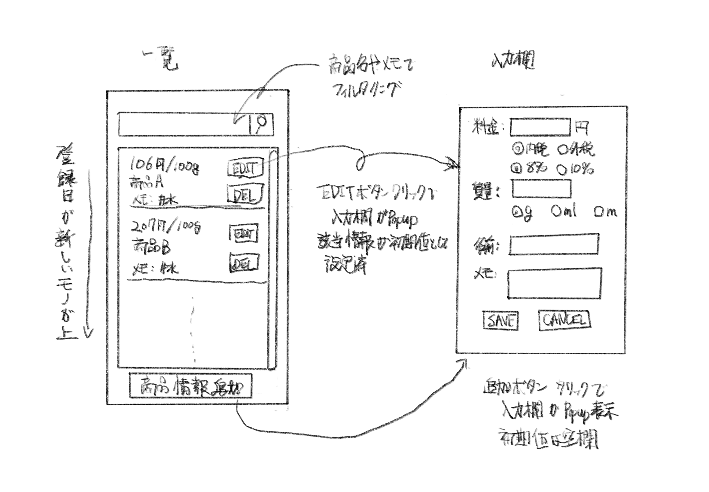

モノを買う時の判断材料として、モノの100gあたりの価格を知りたいと思いました。

React(Next.js)を勉強したので、アプリとして作成したいと思います。
<!--more-->

スーパーとかでは値札に、100gあたりの価格が書いてあるので、商品を比較する時に便利です。
ネットで知らべた商品やチラシの商品なども100gあたりの価格をメモできると便利そうです。

### すすめかた

以下の工程で作成したいと思います。

- コンセプト作成
- シナリオ作成
- アプリの名前
- UIスケッチ / 絵コンテ作成
- 部品一覧作成
- コード作成
- テスト?
- 公開

### コンセプト

まずは洗い出し。アプリについて思い付くものを30個ぐらい書き出す。

- 機能
  - 登録機能
    - 商品の重量(g)、価格を入力すると、100gあたりの価格を表示する
    - 商品の容量(ml)、価格を入力すると、100mlあたりの価格を表示する
    - 商品の容量(m)、価格を入力すると、1mあたりの価格を表示する
  - 編集機能
    - 商品の名前、店舗などの情報も追記できる
    - 入力した情報は、記録用に後から変更できるようにしたい
    - 後から内税、外税、通常税率、軽減税率を変更可能に
    - 商品の質量の単位(重量(g)、容量(ml))を変更可能に
    - 優先度低
      - 商品の簡単な評価もできるようにする?!
      - 追加する情報はタグのようなものが良い?!
      - 購入経験の有無も入力可能に
      - いつのどういった価格かも追記可能に(xxxx/x/xのセール品など)
  - 一覧表示機能
    - 最近入力した情報の何件かが表示されている
    - 優先度低
      - 過去に入力した情報を一覧表示できる
      - 過去に入力した情報を検索できる
  - 管理機能
    - 優先度低
      - 記録データのエクスポート可能に
      - 記録データのインポート可能に
      - 記録データの初期化可能に
  - UI
    - スマフォでの利用が前提
    - 通常モードとダークモードを切り替え可能にしたい
    - ブログに埋め込みたい
    - ブログに単機能の細かいアプリのカテゴリを追加したい
      - 単機能の細かいアプリをシリーズ化したい
- 目的
  - アプリの目的
    - 計算が苦手なので商品を選びの参考にしたい
      - チラシやサイトの情報から、興味ある商品の`単位当たりの価格`を登録する
      - 店内で商品情報から`単位当たりの価格`を知りたい
      - 事前に確認した`単位当たりの価格`と店内で確認した`単位当たりの価格`で商品選びの参考にする
      - 過去に入力済みの`単位当たりの価格`を検索し、商品選びの参考にする
  - 経験の目的
    - デザイン
      - アプリの開発を通じてデザインの勉強をしたい
        - デジタル庁のデザインガイドラインを学ぶ
      - シナリオを作成したい
      - アプリの名前を決めたい
      - UIスケッチを作成したい
      - 絵コンテを作成したい
      - 部品一覧を作成したい
    - ソフト開発
      - テスト方法を勉強したい
- 技術関連
  - Next.jsで作成したい
  - データの保存もブラウザで完結したい
  - プログラミングで数値(金額)の計算はややこしいらしい
- その他

### シナリオ作成

コンセプトから`アプリの目的`部分を抜粋し再構成する。

- 起承
  - ○○を買いたい
  - Amazonで確認してみよう
    - チラシやサイトの情報から、興味ある商品の`単位当たりの価格`を登録する
- 転
  - 実物も見てみたい
    - 店内で商品情報から`単位当たりの価格`を知りたい
- 結
  - 購入するか判断
    - 事前に確認した`単位当たりの価格`と店内で確認した`単位当たりの価格`で商品選びの参考にする
    - 今回は買わない
  - 別の日
    - たまたま近くの店で商品を発見
    - 過去に入力済みの`単位当たりの価格`を検索し、商品選びの参考にする

### アプリの名前(仮)

`単位当たりの価格`を求めるアプリ、つまり以下を求めるので、

~~~text
価格 / 一定の質量
~~~

アプリ名前は以下にします。

~~~quote
perN (発音は"パーン")
~~~

### UIスケッチ

シナリオを実現できるようなUIのスケッチをつくる。

### 部品一覧

デザインについては、[デジ庁のデザインシステム](/notes/design-system)を参考にする。
(ただし、カラーについては、[Color system – Material Design 3](https://m3.material.io/styles/color/the-color-system/key-colors-tones)を参考にする。[^1])

[Storybook: Frontend workshop for UI development](https://storybook.js.org/)を使って、部品一覧を作成する。

[kantas-spike/perN](https://github.com/kantas-spike/perN)にプロジェクトを作成し、その中に`storybook`を作成する。

#### ストーリーブック

- スタイル
  - [01. カラー](./storybook-static/?path=/docs/スタイル-01-カラー--docs)
  - [02. タイポグラフィ](./storybook-static/?path=/docs/スタイル-02-タイポグラフィ--docs)
  - [03. レイアウトカラム](./storybook-static/?path=/docs/スタイル-03-レイアウトカラム--docs)
  - [04. 余白](./storybook-static/?path=/docs/スタイル-04-余白--docs)
  - [05. 画像](./storybook-static/?path=/docs/スタイル-05-画像--docs)
  - [06. 角丸](./storybook-static/?path=/docs/スタイル-06-角丸--docs)
  - [07. リンクテキスト](./storybook-static/?path=/docs/スタイル-07-リンクテキスト--docs)
- コンポーネント
  - [01. ボタン](./storybook-static/?path=/docs/コンポーネント-01-ボタン--docs)
  - [02. リンクテキスト](./storybook-static/?path=/docs/コンポーネント-02-リンクテキスト--docs)

[^1]: [デジ庁のデザインシステム](/notes/design-system)では予め配色が決まっているため
