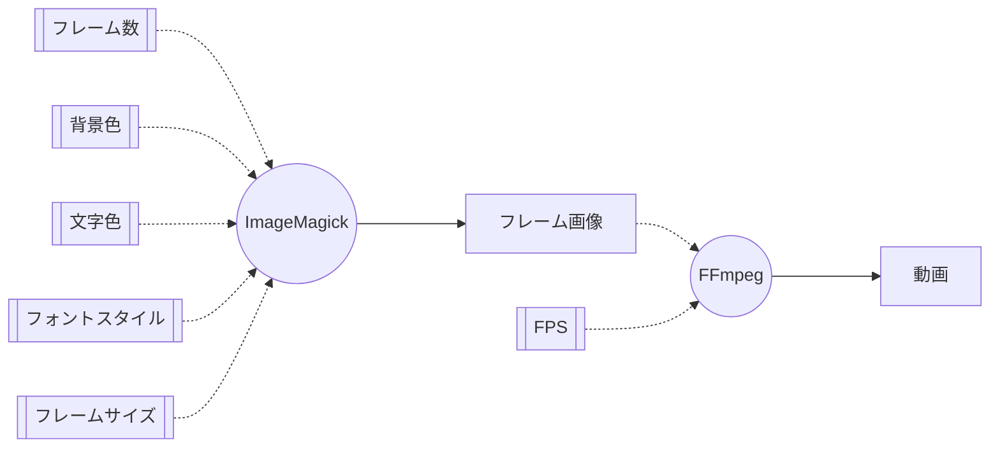
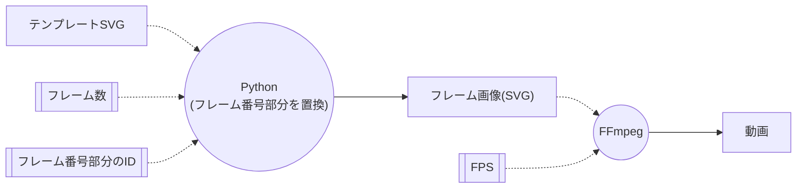
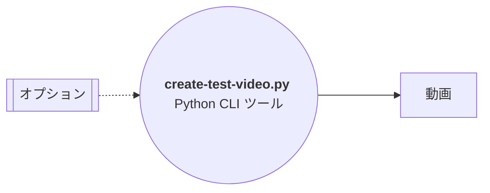

Blender VSEの動作確認用にフレーム番号がついたダミーのサンプル動画を作成したい。

<!--more-->

やりたい事を整理すると以下になります。

- 60FPSで3秒ぐらいの動画の各フレームに連番の番号が付与されているサンプル動画を用意したい。
- フレーム番号のフォントスタイルやフレームの背景色を指定可能にしたい。

### 解決策

#### 検討

以下の2案から検討し、**案2** を採用しました。
PythonによるCLIツールとして作成します。

````column {title="案1: ImageMagickで作成したフレーム画像から動画を生成"}

`ImageMagick` と `FFmpeg` を使う。

[Image/Sequence ストリップ用素材 # 動画編集のためのBlender ストリップの種類とその追加方法 | kanta's spike](https://kantas-spike.github.io/portfolio/articles/2024/04/18-blender%E3%81%A7%E5%8B%95%E7%94%BB%E7%B7%A8%E9%9B%86-%E3%82%B9%E3%83%88%E3%83%AA%E3%83%83%E3%83%97%E3%81%AE%E7%A8%AE%E9%A1%9E%E3%81%A8%E3%81%9D%E3%81%AE%E8%BF%BD%E5%8A%A0%E6%96%B9%E6%B3%95/#imagesequence-%E3%82%B9%E3%83%88%E3%83%AA%E3%83%83%E3%83%97%E7%94%A8%E7%B4%A0%E6%9D%90) で紹介した方法。


````

````column {title="案2: SVGテンプレートをもとに生成したフレームSVG画像から動画を生成"}

Pythonスクリプト と `FFmpeg` を使う。

フレーム番号を記載したテンプレート画像(SVG)を予め用意し、
フレーム番号部分をPythonにより書き換えたフレーム画像(SVG)を作成する。

あとは、フレーム画像をインプットとして `FFmpeg` で動画に変換する。


````

#### 方針

ツールの名前は、 **create-test-video.py** とします。

本ツールは、テンプレートSVG画像から、指定された時間分のテストビデオを作成するツールです。
テンプレートSVG画像に記載されたフレーム番号をツールが自動置換します。

また、テンプレートSVG画像は、[Inkscape](https://inkscape.org/)などのツールにより、事前に作成しておきます。

````column

````

| パラメータ                   | デフォルト値          | 説明                                                                       |
| ---------------------------- | --------------------- | -------------------------------------------------------------------------- |
| テンプレートSVG              | -                     | テンプレートとなるSVG画像のパスを指定する                                  |
| FPS                          | 60                    | 生成する画像のフレームレートを指定する                                     |
| 秒数                         | 1                     | 生成する動画の長さを指定する。 **FPS×秒数** が生成するフレーム画像数になる |
| フレーム画像生成ディレクトリ | テンプディレクトリ    | テンプレートから生成するフレーム画像(SVG)を格納するディレクトリ            |
| フレーム番号のID             | frame_no              | SVG内のフレーム番号部分のID                                                |
| FFmpegのパス                 | /usr/local/bin/ffmpeg | ffmpegコマンドのパス                                                       |
| 出力動画パス                 | output.mp4            | 生成する動画ファイルのパス                                                 |

使い方の例は以下になります。

```shell
create-test-video.py --template template.svg --fps 60 --sec 3 --work-dir ./wk  --output output.mp4
```

#### 開発

以下のリポジトリでツールを作成しました。

```column {title="テストビデオ作成ツール"}
[kantas-spike/create-test-video.py](https://github.com/kantas-spike/create-test-video.py?tab=readme-ov-file)
```

- 実行例

  ```shell
  python create-test-video.py -t ./sample_template/red_inkscape.svg -o sample_output/red.mp4 -d 3
  ```

- 作成結果

  

#### 課題

[FFmpeg](https://ffmpeg.org/) で SVGを利用するためには、[librsvg](https://gitlab.gnome.org/GNOME/librsvg)を有効にしてビルドする必要があるようです。

私の環境は macOS なのですが、[Homebrew](https://brew.sh/) の [ffmpeg](https://github.com/Homebrew/homebrew-core/blob/34548975576ea25f2fb6fbd0b3d034f1edad2184/Formula/f/ffmpeg.rb) では、**librsvg** は無効になっています。

そのため、[Homebrew公式のffmpeg](https://github.com/Homebrew/homebrew-core/blob/34548975576ea25f2fb6fbd0b3d034f1edad2184/Formula/f/ffmpeg.rb)を修正し、**librsvg** を有効にしたFomulaを用意しました。([差分](https://github.com/kantas-spike/homebrew-ffmpeg-with-librsvg/commit/fa86f9d8c92fbfe988cf8996866acc1102d49041))

```column {title="librsvg有効化版ffmpegのFormula"}
[kantas-spike/homebrew-ffmpeg-with-librsvg](https://github.com/kantas-spike/homebrew-ffmpeg-with-librsvg)
```

以下により`ffmpe`をアンインストール後に、

```shell
brew uninstall --ignore-dependencies ffmpeg
```

本Formulaをダウンロードし、以下を実行すると、 **librsvg有効版ffmpeg**をビルド・インストールできます。(ビルドには時間がかかります。)

```shell
brew install --build-from-source --formula ffmpeg.rb
```

こんなことなら **案1** を採用すべきだったかもしれません。
しかし、**案2** は、[Inkscape](https://inkscape.org/)などを使って、手軽にテンプレートを作成できるので、作成できるテストビデオを自由度を考えると **案2** で良かったと思います。

### 参考

- [ImageMagick – Mastering Digital Image Alchemy](https://imagemagick.org/index.php)
- [FFmpeg](https://ffmpeg.org/)

- [Image/Sequence ストリップ用素材 # 動画編集のためのBlender ストリップの種類とその追加方法 | kanta's spike](https://kantas-spike.github.io/portfolio/articles/2024/04/18-blender%E3%81%A7%E5%8B%95%E7%94%BB%E7%B7%A8%E9%9B%86-%E3%82%B9%E3%83%88%E3%83%AA%E3%83%83%E3%83%97%E3%81%AE%E7%A8%AE%E9%A1%9E%E3%81%A8%E3%81%9D%E3%81%AE%E8%BF%BD%E5%8A%A0%E6%96%B9%E6%B3%95/#imagesequence-%E3%82%B9%E3%83%88%E3%83%AA%E3%83%83%E3%83%97%E7%94%A8%E7%B4%A0%E6%9D%90)
- [kantas-spike/create-test-video.py: テンプレートSVG画像をもとに、指定された時間分のフレーム画像を作成し、そのフレーム画像からテストビデオを作成します。](https://github.com/kantas-spike/create-test-video.py)
- [kantas-spike/homebrew-ffmpeg-with-librsvg: FFMpegでSVGを利用可能にするためlibrsvgの利用を有効にしたFormula](https://github.com/kantas-spike/homebrew-ffmpeg-with-librsvg)
