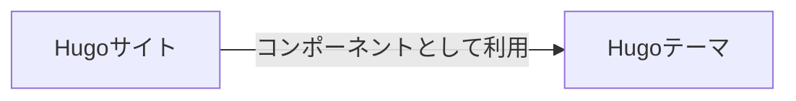
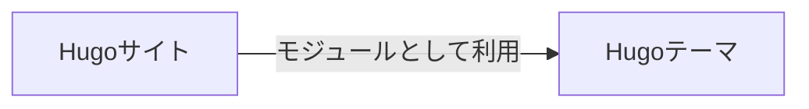

Hugoのテーマをモジュールとして利用したい。

<!--more-->

これまでは、本サイトではGitHubで開発している[自作のHugoテーマ](https://github.com/kantas-spike/kantas-theme)をコンポーネントとして利用してきた。[^1]



コンポーネント方式のテーマ導入に必要なことは以下になる。

| サイト側                                      | テーマ側 |
| --------------------------------------------- | -------- |
| `git submodule add URL`でテーマをダウンロード | なし     |
| hugo.tomlの`theme`にテーマ名を設定            |

Hugoには[Hugo Modules](https://gohugo.io/hugo-modules/use-modules/#use-a-module-for-a-theme)という方式もあるため、そちらに移行したい。



### 解決策

```column {title="前提"}

Hugo ModulesはGo言語のModule機能を利用しているため、予め[The Go Programming Language](https://go.dev/dl/)のインストールが必要になる。

参照: [Prerequisite | Use Hugo Modules | Hugo](https://gohugo.io/hugo-modules/use-modules/#prerequisite)
```

#### 移行方法

今回のモジュール方式でテーマ導入に必要なことは以下になる。

| サイト側                                           | テーマ側                      |
| -------------------------------------------------- | ----------------------------- |
| `hugo mod init`でモジュール化                      | `hugo mod init`でモジュール化 |
| hugo.tomlの`module.imports`でテーマをインポート    |
| 必要に応じて、hugo.tomlの`module.mounts`でマウント |

具体的な手順は以下となる。

##### 手順1. テーマ側をHugoモジュール化

[GitHubで管理している自作テーマ](https://github.com/kantas-spike/kantas-theme)をクローンする。

```shell
git clone https://github.com/kantas-spike/kantas-theme.git
cd kantas-theme
```

以下のコマンドを実行し、Hugoモジュール化する。

`hogo mod init`の後には、`github.com/<your_user>/<your_project>`を指定する必要がある。

```shell
hugo mod init github.com/kantas-spike/kantas-theme
```

`go.mod`というファイルが追加されるので、コミットし、GitHubにプッシュする。

#### 手順2. サイト側をHugoモジュール化

Hugoのモジュールを利用するためには、サイト側もモジュール化する必要がある。

以下のコマンドを実行し、モジュール化する。

サイトの場合、他のモジュールから利用されることはないため、
`hogo mod init`の後には、適当な名前を付ける。今回は`myblog`を指定した。[^4]

```shell
cd myblog
hugo mod init myblog
```

#### 手順3. サイト側のhugo.tomlを変更

1. まず。`hugo.toml`の`theme`設定を削除する。

   ```toml
   # ...略...

   # 実際は以下の設定をコメントアウトではなく削除する
   # theme = 'kantas'

   # ...略...
   ```

2. `hugo.toml`でテーマをインポート

   以下を追加し、テーマをモジュールとしてインポートする。

   ```toml
   # ...略...
   [module]
     [[module.imports]]
       path = 'github.com/kantas-spike/kantas-theme'
   # ...略...
   ```

3. `hugo.toml`に必要なファイルをマウントする

   本ブログでは、`tailwindcss`を採用している。
   `tailwindcss`の不要CSSクラスの削除用に、Hugoの`hugo_stats.json`を利用している。[^3]

   `hugo_stats.json`を生成・監視用の設定として以下を追加している。

   ```toml
   # テーマで使用するtailwindcss用の設定
   [build]
     writeStats = true
     [[build.cachebusters]]
       source = "assets/watching/hugo_stats\\.json"
       target = "theme\\.css"
     [[build.cachebusters]]
       source = "assets/js/.*\\.js"
       target = "theme\\.css"
   ```

   この監視用の`[[build.cachebusters]]`設定では、`source`にマウントされた仮想ファイルシステム上のパスを指定する必要がある。
   そのため、以下の`mount`設定も追加している。

   ```toml
   # ...略...
   [module]
      # (A)のみ設定すると、
      # デフォルト設定の"assets"のマウントが外れるため明示的に設定
      [[module.mounts]]
        source = "assets"
        target = "assets"
      [[module.mounts]] # (A)
        source = "hugo_stats.json"
        target = "assets/watching/hugo_stats.json"
   # ...略...
   ```

   まとめると、`[module]`と`[build]`で`hugo.toml`に以下の設定をしている。

   ```toml
   # ...略...
   [module]
    # テーマで使用するアセットの登録
    [[module.mounts]]
      source = "assets"
      target = "assets"
    [[module.mounts]]
      source = "hugo_stats.json"
      target = "assets/watching/hugo_stats.json"
    # テーマのインポート
    [[module.imports]]
      path = 'github.com/kantas-spike/kantas-theme'

    # テーマで使用するtailwindcss用の設定

    [build]
      writeStats = true
      [[build.cachebusters]]
        source = "assets/watching/hugo_stats\\.json"
        target = "theme\\.css"
      [[build.cachebusters]]
        source = "assets/js/.\*\\.js"
        target = "theme\\.css"
    # ...略...
   ```

4. 最後に、テーマ側に必要なパッケージをサイト側にインストールする

   以下を実行して、テーマで利用しているパッケージをサイト側で収集する。

   ```shell
   hugo mod npm pack
   ```

   `package.json`に、テーマに必要なパッケージが反映されるので、
   以下を実行し、パッケージをインストールする。

   ```shell
   npm install
   ```

### 参考

- [Use Hugo Modules | Hugo](https://gohugo.io/hugo-modules/use-modules/#use-a-module-for-a-theme)
- [Hugo Modules の仕組みで Hugo サイト用のコンテンツを分割して管理する - まくまく Hugo ノート](https://maku77.github.io/p/bqar8o6/)
- [kantas-spike/kantas-theme: Hugo theme for programming learner portfolio](https://github.com/kantas-spike/kantas-theme/blob/main/README.md)
- [gitのsubmoduleを削除したい | kanta's spike]()

[^1]: [Quick start | Hugo](https://gohugo.io/getting-started/quick-start/)に従った方法である。
[^3]: [Configure Hugo | Hugo](https://gohugo.io/getting-started/configuration/#configure-build), [Configure Hugo | Hugo](https://gohugo.io/getting-started/configuration/#configure-cache-busters)
[^4]: サイトはGitHubではなく、ローカルの`myblog`フォルダーで管理されているものとする。
